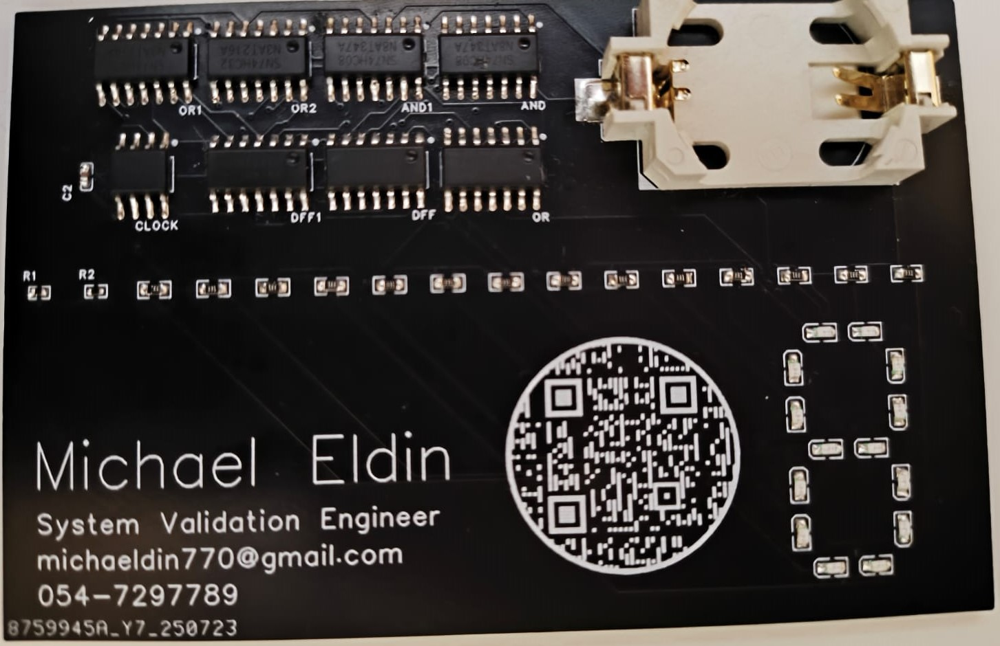

# Logic Gate Business Card

A fully functional **PCB business card** that demonstrates digital logic design using discrete ICs.  
This card integrates **AND, OR, gates, D flip-flops and an NE555 clock generator** — all powered by a single CR2032 coin cell.  
It is not just a card, but also an **interactive logic demo** you can carry in your pocket.

---

## ✨ Features
- PCB size: **90 mm × 50 mm** (standard business card size)  
- Power: **CR2032 coin cell**  
- Components:
  - `74HC08` — AND gates  
  - `74HC32` — OR gates  
  - `74HC74` — D flip-flops  
  - `NE555` — 1 Hz clock generator  
  - 7-segment-style LED arrangement to visualize digits  
- Integrated **QR code** with my contact information  

---

## 🧩 How It Works
- The **NE555 timer** generates a ~1 Hz clock signal.  
- The clock drives the **4-bit counter (made of 4 DFFs)**, which increments automatically.
- Combinational logic (using logic gates) manipulate the counter output to show my phone number.
- The output is displayed using discrete LEDs arranged as digits.  

---
## 📜 License
MIT License — feel free to use, modify, and build your own logic business card.

---

## 🙋 About
Created by **Michael Eldin**  
System Validation Engineer  
📧 michaeldin770@gmail.com  
🔗 [LinkedIn](https://www.linkedin.com/in/michael-eldin-37a20b162/)
